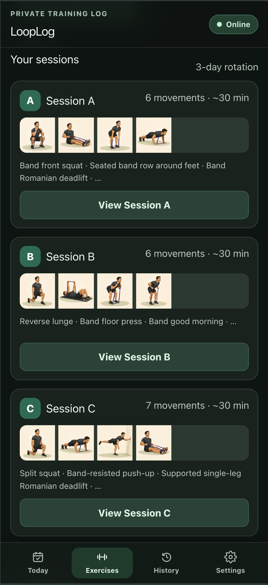
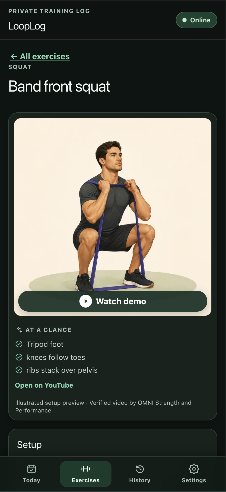
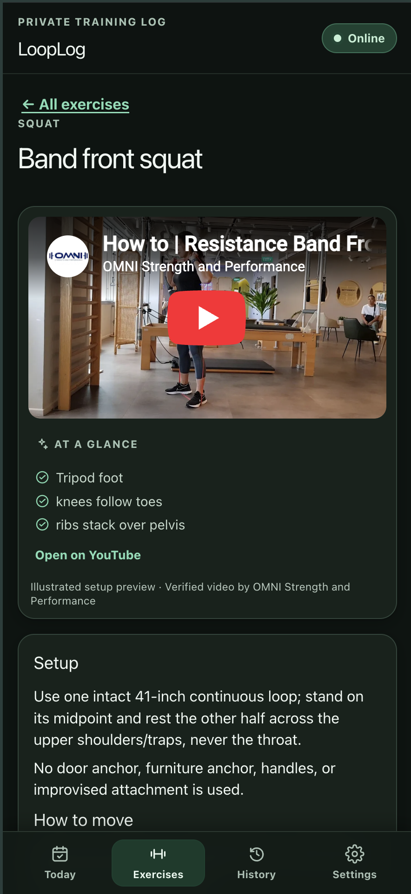

# LoopLog

LoopLog is an installable, mobile-first resistance-band workout PWA. It is designed for one person using a 41-inch Serious Steel loop-band set. All profile, schedule, workout, and backup metadata stays in the browser's IndexedDB database; the app has no account, backend, analytics, or tracking.

Written exercise guidance, workout logging, history, recommendations, settings, and backup validation work offline after the app has been loaded once. YouTube demonstrations are optional and require a connection.

LoopLog includes a low-glare dark theme alongside Light and System appearance choices. Open **Settings → Appearance** to choose a preference; System follows the device setting live and your choice stays local to this browser.

## Preview

Shown in dark mode, LoopLog keeps the workout flow easy to scan in low light: review the session rotation, check an illustrated movement setup, and open an optional YouTube demonstration when you want one.

<table>
  <tr>
    <td align="center"></td>
    <td align="center"></td>
    <td align="center"></td>
  </tr>
  <tr>
    <td align="center"><sub>Build a clear session rotation</sub></td>
    <td align="center"><sub>Learn the setup at a glance</sub></td>
    <td align="center"><sub>Watch a verified demonstration</sub></td>
  </tr>
</table>

<p align="center"><em>Plan each session, follow visual movement guidance, and load verified YouTube demonstrations only when you choose.</em></p>

## Requirements

- Node.js 22 or newer
- npm 10 or newer
- A current browser with IndexedDB and Web Crypto support
- Playwright browser binaries for end-to-end testing

## Local development

```sh
npm ci
npm run dev
```

Open the URL printed by Vite. Development data is saved only for that local origin. Changing the hostname or port can create a separate browser storage origin.

The production build and local static preview are:

```sh
npm run build
npm run preview
```

The generated `dist/` directory is the complete static deployment artifact. No environment variables, secrets, database credentials, or server routes are required.

## Verification

Run the release gates before deployment:

```sh
npm ci
npm run typecheck
npm run lint -- --max-warnings=0
npm run test:unit
npm run test:component
npm run build
npx playwright install chromium webkit
npm run test:e2e
npm run test:a11y
```

The test suites cover scheduling and Toronto timezone boundaries, progression, content completeness, IndexedDB migrations and lifecycle, backup validation/merge/replace rollback, component behavior, production PWA metadata, mobile accessibility, offline workouts, and backup recovery.

## Local data and privacy

The UI and domain code depend only on `StorageAdapter`. `IndexedDbStorageAdapter` is the sole Dexie/IndexedDB implementation. Exercise definitions and program templates are versioned static application content rather than personal data.

Browser storage is durable but is not a cloud backup. Safari website-data deletion, uninstalling the Home Screen app, clearing browser data, or moving the deployment to another domain can make unexported history inaccessible. The data is protected by the phone's normal device security but is not separately encrypted in IndexedDB or in an exported JSON file.

## Backup, restore, and phone migration

To create a backup:

1. Open **Settings → Backups**.
2. Select **Export backup**.
3. On iPhone, save the JSON file to Files or iCloud Drive from the share sheet. If file sharing is unavailable, the browser downloads the file.
4. Confirm that Today or Settings shows the successful backup date.

The export is human-readable JSON containing a schema version, application version, export time, user records, and SHA-256 checksum. Treat it as private workout data.

To restore or migrate to a new phone:

1. Open the same stable production URL on the destination phone and install it if desired.
2. Open **Settings → Backups** and choose the JSON file.
3. Review the workout count, date range, bands, and export date.
4. Choose **Merge** to deduplicate records and keep the copy with the newest `updatedAt` timestamp.
5. Use **Replace all local data** only when the imported file should become the complete local state. Replacement requires a second confirmation and uses a safety snapshot for rollback if the import fails.
6. Reload and verify History before deleting the old phone's copy.

Malformed JSON, unsupported future schemas, broken record relationships, duplicate identities, and checksum failures are rejected before storage is changed.

## Install on iPhone

Use Safari; other iOS browsers may not expose the same installation flow.

1. Visit the stable HTTPS production URL in Safari.
2. Tap **Share**.
3. Choose **Add to Home Screen** (scroll the action list if necessary).
4. Keep the displayed name and tap **Add**.
5. Launch LoopLog from the new Home Screen icon.
6. Complete onboarding and export a first backup after completing a workout.

Open the app online once after an update so the new application shell can be cached. Do not change the production domain after users begin logging workouts; IndexedDB belongs to the exact web origin.

## Deploy to Vercel

This repository is configured as a static Vite application with SPA fallback routing.

1. Push the repository to a Git provider only when you are ready to publish it.
2. In Vercel, select **Add New → Project** and import the repository.
3. Confirm the framework preset is **Vite**.
4. Use `npm run build` as the build command and `dist` as the output directory.
5. Do not add environment variables; V1 has no backend or secret configuration.
6. Deploy, then choose one production domain and keep it stable.
7. Open the production URL, verify the manifest and service worker, complete a short test workout offline, and test JSON export/import before relying on it.
8. Install that exact production URL on the iPhone using the steps above.

Vercel hosts only static files. Runtime external services are limited to Vercel for hosting and YouTube for user-initiated demonstrations.

## Exercise media maintenance

Every workout exercise has an original, locally cached setup illustration plus one attributed, click-to-load YouTube demonstration. Artwork provenance and review guidance are in [`docs/EXERCISE_ART.md`](docs/EXERCISE_ART.md). The canonical video source, equipment/anchor fit, and verification date are recorded in [`docs/MEDIA_MAINTENANCE.md`](docs/MEDIA_MAINTENANCE.md). Recheck every source before a public release and at least quarterly. Written guidance remains the primary offline resource.

## Future Supabase adapter

Cloud synchronization is intentionally out of scope for V1. A future `SupabaseStorageAdapter` should implement the existing `StorageAdapter` contract and map the same UUIDs, normalized records, timestamps, target snapshots, and plan identifiers. UI components must continue to consume the adapter through the provider and must not import either Dexie or Supabase directly.

Keep synchronization-specific operations in a separate optional interface so local-only builds remain free of authentication and backend dependencies. Any future sync design must define conflict resolution and protect immutable workout history before it is enabled.

## Safety and limitations

Band resistance changes with stretch, setup, and grip and is not equivalent to a fixed weight. Inspect bands before use, keep them away from the face and neck, use controlled motion on a stable surface, and stop for sharp, radiating, or worsening pain. LoopLog provides general exercise guidance, not medical diagnosis, rehabilitation, or clinician-supervised programming.

V1 does not provide cross-device synchronization, automatic cloud backup, notifications, social features, calorie tracking, live form analysis, or AI-generated workouts.
